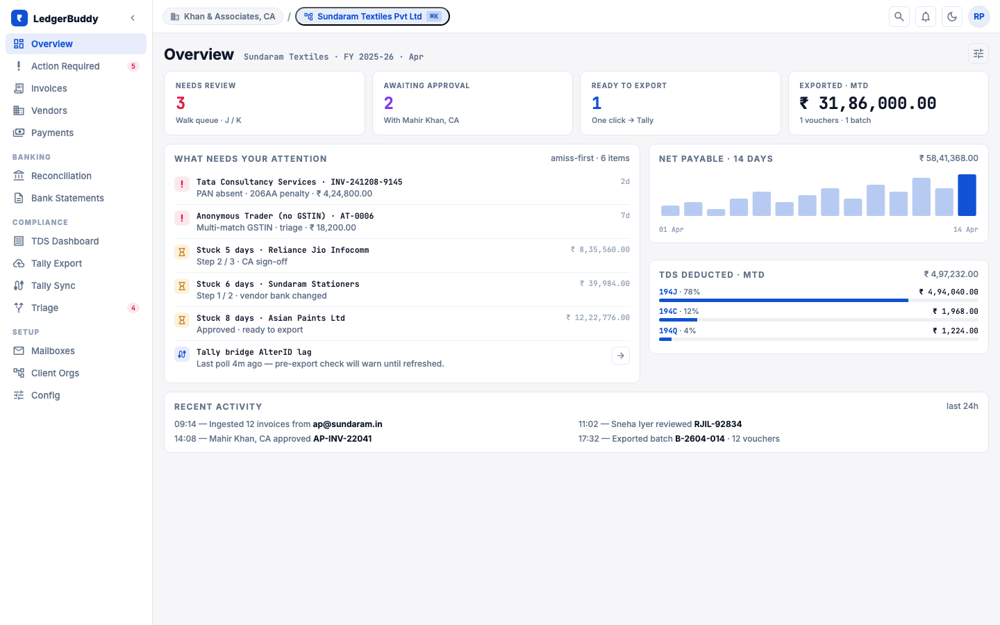
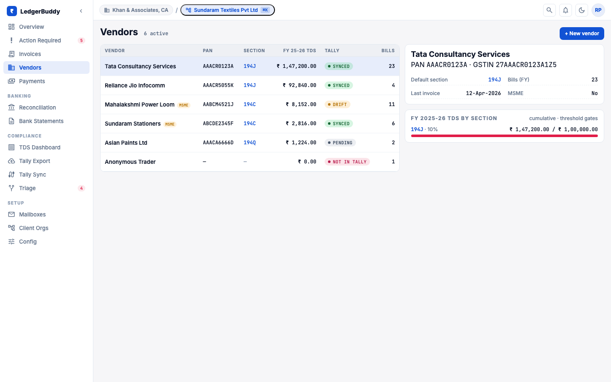
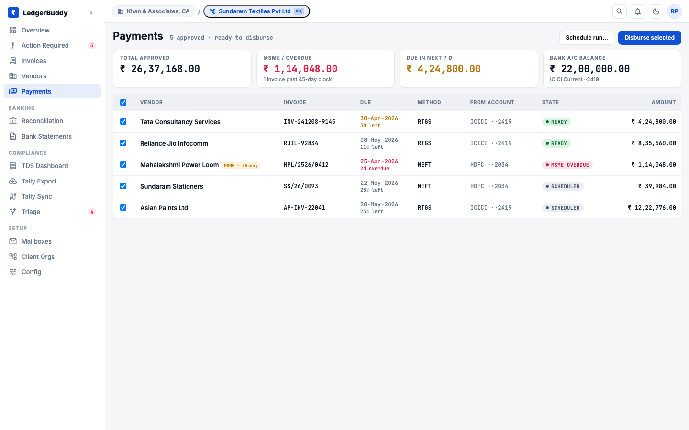
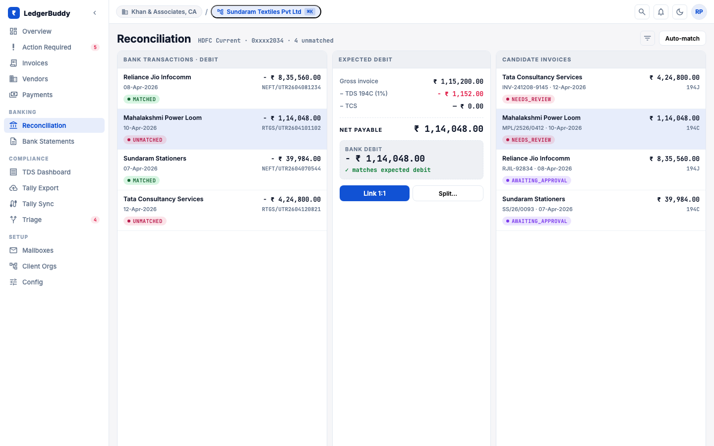
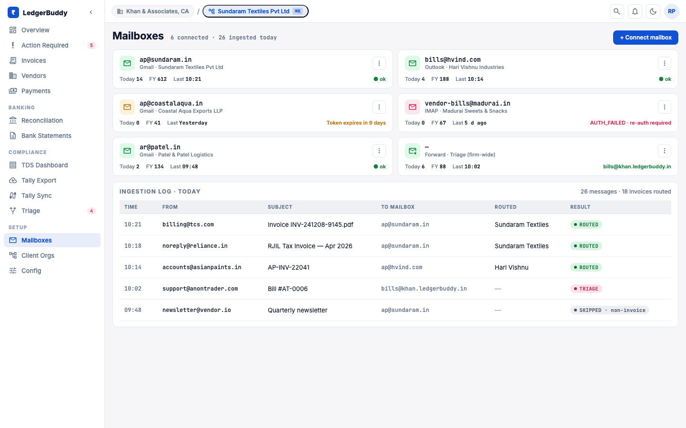
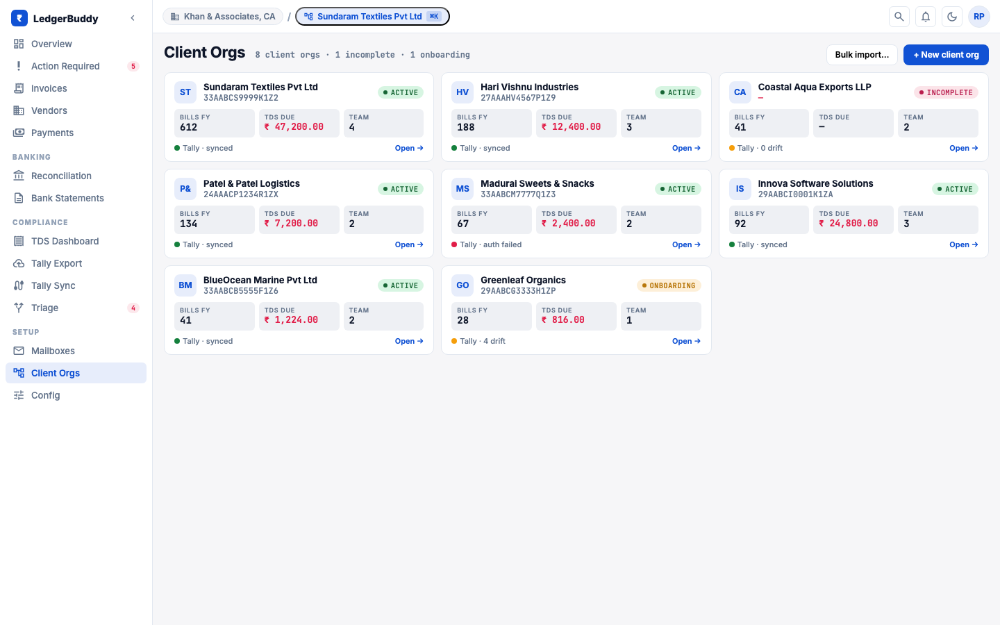
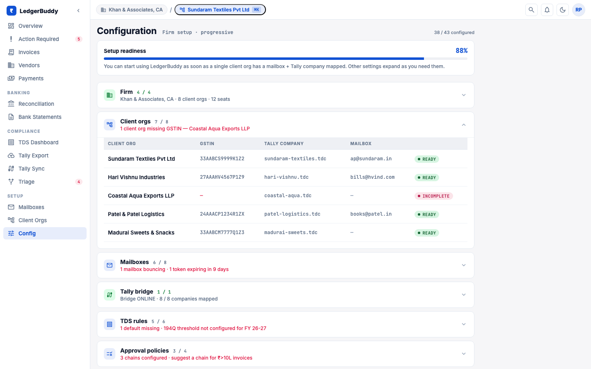

# LedgerBuddy

LedgerBuddy is a multi-tenant accounts-payable platform built for Indian CA firms. One firm, many client organisations: every client org is an isolated realm with its own vendor master, GST/TDS configuration, approval workflow, and Tally Prime company. The pipeline ingests invoices from Gmail or upload, runs OCR + SLM extraction, applies India-specific compliance enrichment (CGST/SGST/IGST split, TDS section detection, cumulative-threshold tracking, MSME deadlines, GSTIN/PAN cross-checks), routes for approval, and produces Tally-importable XML — purchase vouchers today, payment vouchers in Phase 4. The differentiators are GSTIN-first compliance, dual-tagged ledger XML that Tally actually accepts, and a CA-firm topology where one operator switches across realms without leaving the app.

The product was previously called BillForge; the codebase, package names, and design canvas have all moved to **LedgerBuddy**. A handful of legacy artefacts (e.g. `docs/architecture.drawio`) still carry the old name and will be renamed in-flight.

## Visual reference

The current UI direction (post-Wave-3 redesign) is captured below. Captured from the claude.ai/design canvas at 1440×900 — the kit ships as a single React SPA with a left sidebar + top realm-switcher shell (`Cmd-K` to switch client org, `Cmd-\` to collapse the sidebar).

### Dashboard
KPIs across the active realm, action-required queue, recent ingestion trail.



### Action queue
Invoices that need review or approval, filtered by status with keyboard-driven walk-queue.


### Triage
Firm-wide unrouted invoices that auto-routing could not place into a client org — explicit routing decision per row.


### Invoices
Full table with payment/aging columns and per-invoice payment history.


### Vendors
List with search/filter/sort; detail page (not shown) carries Invoices and TDS sub-tabs, Section 197 cert panel, merge dialog.



### Payments
Single / multi-invoice / advance / reversal flows with MSME 45-day overdue surfacing and method-specific validation.



### TDS dashboard
FY switcher, quarter drill-down, KPIs, liability table, cumulative chart, pending-challan deposits.


### Tally export
Batch tracker with `AlterID`, retry-failed action, re-download for completed batches.


<details>
<summary>Additional surfaces (Reconciliation, Bank statements, Tally sync, Mailboxes, Client orgs, Config)</summary>

### Reconciliation


### Bank statements


### Tally sync


### Mailboxes


### Client orgs


### Tenant config


</details>

## Architecture at a glance

- **Multi-tenant Mongo** (Atlas in production, local Mongo 7 via Docker for dev). Every collection carries a `tenantId` discriminator; per-realm data is scoped server-side.
- **Backend**: Node 20 + TypeScript 5 strict + Express 4 + Mongoose 8 + Zod 3. URL providers are typed end-to-end (`*Urls.ts`) — no raw path strings at routers or call sites (see `feedback_url_abstraction_directive` in agent briefs).
- **Frontend**: React 18 + Vite 6 + TypeScript strict + Zustand 5 + Recharts. Functional pass and design pass ship as separate PRs per the FE split convention.
- **Ingestion**: Gmail OAuth (production), MailHog (local), S3 / MinIO drop, manual upload. Each invoice tracks source mailbox + receipt timestamp.
- **OCR + extraction pipeline** (composable, see [docs/COMPOSABLE_PIPELINE.md](docs/COMPOSABLE_PIPELINE.md)): Apple Vision / DeepSeek MLX / LlamaParse for OCR; LlamaExtract / MLX SLM / Claude / Anthropic API for field extraction. Confidence scoring with per-field bounding boxes.
- **Tally export**: file-based today (XML download → manual import) with structurally correct `ALLLEDGERENTRIES.LIST` + `BILLALLOCATIONS` + `ISINVOICE=Yes`. Phase 6+ moves to a desktop bridge agent.

For the full system picture: [docs/architecture.drawio](docs/architecture.drawio), [docs/diagrams/system-architecture.drawio](docs/diagrams/system-architecture.drawio), [docs/images/invoice-pipeline.svg](docs/images/invoice-pipeline.svg).

## Phase 0–5 roadmap

The accounting-payments initiative formalises payment recording, TDS cumulative tracking, Tally XML correctness, vendor CRUD, and reconciliation v2. Source of truth: [docs/accounting-payments/MASTER-SYNTHESIS.md](docs/accounting-payments/MASTER-SYNTHESIS.md), with backend and frontend RFCs alongside it. Tracking labels on GitHub: `accounting-payments`, `phase:N-*`.

| Phase | Status | Headline scope |
|---|---|---|
| Phase 0 | Shipped | Tally Purchase Voucher XML structural fixes — `ALLLEDGERENTRIES.LIST`, `ISINVOICE=Yes`, `BILLALLOCATIONS` with `New Ref`, `<REFERENCE>` + `<EFFECTIVEDATE>`, deterministic GUID. |
| Phase 0.5 | In progress | `ExportBatch` per-invoice items, re-export-failures endpoint, `LINEERROR` ordinal correlation (#277). |
| Phase 1 | In progress | TDS cumulative tracking — `TdsVendorLedger` model + service (#255), pure-fn `TdsCalculationService` with rate hierarchy (#256), idempotent backfill (#257), `GET /api/reports/tds-liability` (#258), TDS dashboard FE (#259), `AuditLog` model (#260), FY archival + chaos harness (#278), runbook (#279). |
| Phase 2 | Upcoming | Vendor CRUD — `VendorMaster` + tenant fields incl. TAN, Section 197 cert, `tallyLedgerName`, deductee type, MSME history (#261); CRUD + atomic merge + cert upload (#262); list (#263) and detail (#264) FE; runbook (#280). |
| Phase 3 | Upcoming | Payment recording — `Payment` model + invoice payment fields (#265); `PaymentService` with allocation, duplicate-UTR guard, multi-doc txn `paymentStatus` recompute (#266); reversal flow + cash-limit risk signal (#267); recording UI for single / multi-invoice / advance / reversal (#268); payment + aging columns (#269); runbook (#281). |
| Phase 4 | Upcoming | Payment voucher Tally export — XML builder with `BILLALLOCATIONS` `Agst Ref`, GUID, batch chunking (#270); `POST /exports/tally/payment-vouchers` with per-tenant mutex + `ExportBatch` tracking (#271); export panel UI (#272). |
| Phase 5 | Upcoming | Reconciliation v2 — `ReconciliationMapping` junction model + repo (#273), dual-write shim + nightly consistency check (#274), TDS-adjusted scoring with ±2-day tolerance + benchmark gate (#275), split/aggregate detection (subset-sum ≤10) + manual mapping endpoints (#276), aging report with MSME 45-day overdue split (#282). |

Cross-cutting infrastructure (typed URL provider coverage, walker enforcement, contract-walker retirement, Zustand store coverage follow-ups) is tracked under `infra:typed-url-coverage` and the related sub-issues; see `feedback_freeze_features_until_wave3.md` for the current freeze status.

The MVP target is Phase 0 + 1 + 2 + 3 + 4 + UX quick wins (~14 weeks). Phase 5 lands shortly after.

## Local development

Prerequisites: Node 20+, Yarn 4+ (Berry, the repo is a Yarn workspace), Docker, Python 3.11+ (Apple Silicon recommended for local MLX).

```bash
git clone <repo-url> && cd LedgerBuddy
yarn install
yarn docker --preset=llamaextract-lowcost
```

Set `LLAMA_CLOUD_API_KEY` in your shell before bringing the stack up. Open <http://localhost:5177> and log in as `tenant-admin-1@local.test` / `DemoPass!1`. The stack seeds two demo tenants, a sample realm, and a handful of pre-ingested invoices.

### Service map

| Service | Host URL |
|---|---|
| Frontend | `http://localhost:5177` |
| Backend API | `http://localhost:4100` |
| Keycloak | `http://localhost:8280` |
| MinIO console | `http://localhost:9101` |
| MongoDB | `localhost:27018` |
| Mongo Express | `http://localhost:8181` |
| MailHog | `http://localhost:8125` |
| Redis | `localhost:6379` |

### Launch profiles

LedgerBuddy uses a composable profile system instead of per-combination scripts:

```bash
yarn docker --preset=llamaextract-lowcost          # managed cloud, fastest path
yarn docker --engine=claude --extraction=multi     # local Claude CLI
yarn docker --engine=mlx --extraction=single       # local MLX
yarn docker --preset=claude-single-apple           # Apple Vision + Claude
yarn docker --engine=api --ocr=llamaparse          # LlamaParse + Anthropic API
yarn profile:list                                  # all options
```

Dimensions: `--engine={claude|mlx|codex|api}`, `--ocr={default|apple_vision|llamaparse}`, `--extraction={default|single|multi}`. See [docs/LAUNCH_PROFILES.md](docs/LAUNCH_PROFILES.md) for the full matrix.

### Stack management

```bash
yarn docker:down          # stop stack, keep ML services warm
yarn docker:down:all      # stop everything
yarn docker:reload        # rebuild and restart
yarn slm --engine=mlx     # restart SLM only
yarn logs:local           # tail all service logs
```

### Day-to-day commands

```bash
yarn dev                  # backend + frontend in watch mode (against running stack)
yarn test                 # unit tests, BE + FE
yarn coverage:check       # threshold-enforced coverage
yarn knip                 # dead-code analysis (CI gate)
yarn quality:check        # knip + coverage combined
yarn e2e:local            # backend E2E against live stack
yarn e2e:frontend:local   # FE Playwright E2E
yarn build                # production build, BE + FE
```

## Repo layout and further reading

```
LedgerBuddy/
├── ai/              # Python ML services (OCR, SLM)
├── backend/         # Express + TypeScript API (Mongoose, Zod, typed URL providers)
├── frontend/        # React + Vite + Zustand
├── dev/             # scripts, profiles, sample invoices
├── infra/           # Keycloak realm exports, Mongo seed, Terraform modules
├── docs/            # architecture, RFCs, runbooks
└── docker-compose.yml
```

Where to look next:

- [docs/accounting-payments/](docs/accounting-payments/) — Phase 0–5 RFCs, MASTER-SYNTHESIS, PRD, implementation plan v4.3.
- [docs/PRD-CA-FIRMS-INDIA.md](docs/PRD-CA-FIRMS-INDIA.md) — domain reference for the Indian CA firm persona.
- [docs/COMPOSABLE_PIPELINE.md](docs/COMPOSABLE_PIPELINE.md) — OCR + extraction pipeline composition.
- [docs/runbooks/](docs/runbooks/) — operations runbooks (Tally exporter today; payment + TDS + vendor runbooks land per phase).
- [docs/AWS_DEPLOYMENT_GUIDE.md](docs/AWS_DEPLOYMENT_GUIDE.md), [docs/LOCAL_DEEPSEEK_OCR_SETUP.md](docs/LOCAL_DEEPSEEK_OCR_SETUP.md), [docs/TROUBLESHOOTING.md](docs/TROUBLESHOOTING.md).

## Deployment

```bash
ENV=stg AWS_REGION=us-east-1 bash ./dev/scripts/deploy-aws.sh
```

Terraform modules cover EC2 spot workers, DocumentDB, S3, ECS-hosted Keycloak, and IAM. Detail: [docs/AWS_DEPLOYMENT_GUIDE.md](docs/AWS_DEPLOYMENT_GUIDE.md).

## License

[MIT](LICENSE)
